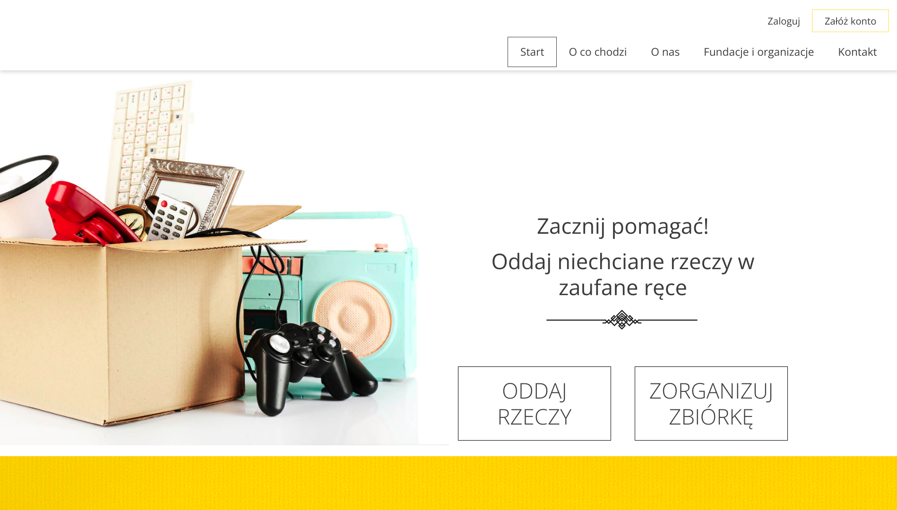
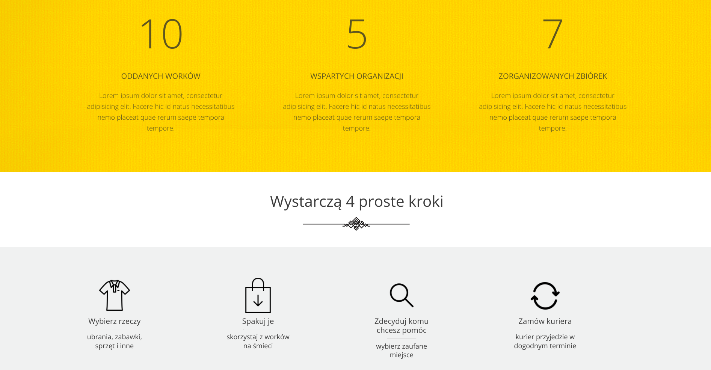
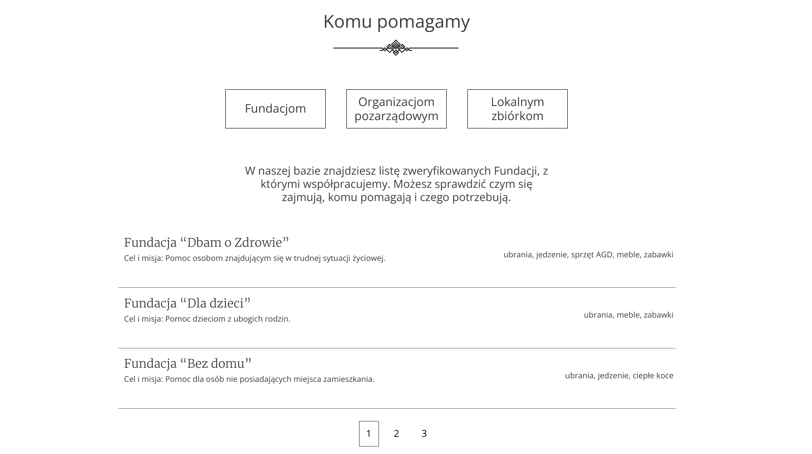
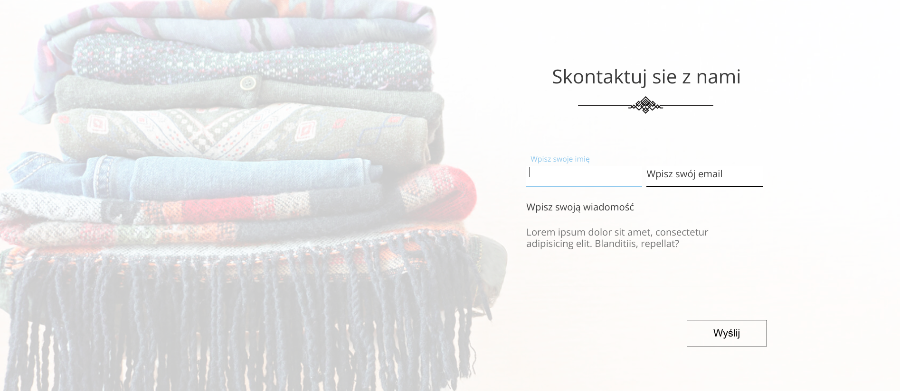

# Oddam w dobre ręce

> Portfolio Lab project

## Table of contents

* [General info](#general-info)
* [Screenshots](#screenshots)
* [Technologies Used](#technologies-used)
* [Features](#features)
* [Setup](#setup)
* [Project Status](#project-status)
* [Room for Improvement](#room-for-improvement)
* [Acknowledgements](#acknowledgements)
* [Contact](#contact)

## General info

The aim of the project is to prepare a website that will enable the transfer of useful items, 
which will be of service to another person or a trusted institution for whom the items will be useful. 
The assumptions set out a website with a simple form that will make it easier for users to return things.

## Screenshots

## Technologies Used

- JavaScript
- React - version 18.0.0 
- SASS, (CSS Grid Layout)
- Block__Element--Modifier (BEM)
- HTML 5.1
- ITCSS (organizational issues, layered structure)
- Firebase

## Features

- Home Page and Form layout
- Form - validation
- Pagination

## Setup

This project was bootstrapped with [Create React App](https://github.com/facebook/create-react-app).

### Available Scripts

In the project directory, you can run:

### `npm start`

Runs the app in the development mode. 
Open [http://localhost:3000](http://localhost:3000) to view it in the browser.

The page will reload if you make edits. 
You will also see any lint errors in the console.

### `npm run build`

Builds the app for production to the `build` folder. 
It correctly bundles React in production mode and optimizes the build for the best performance.

## Project Status

Project is: _in progress_

## Room for Improvement

List of features TODOs for future development:

- Logging out with authentication using Firebase
- Internationalization (Polish, English)
- Mobile version

## Acknowledgements

- Many thanks to preceptor Grzegorz Kowalski from Coders Lab who advised with new advice

## Contact

Created by Krystian Marciniak krystianmarciniak446@gmail.com - feel free to contact me!